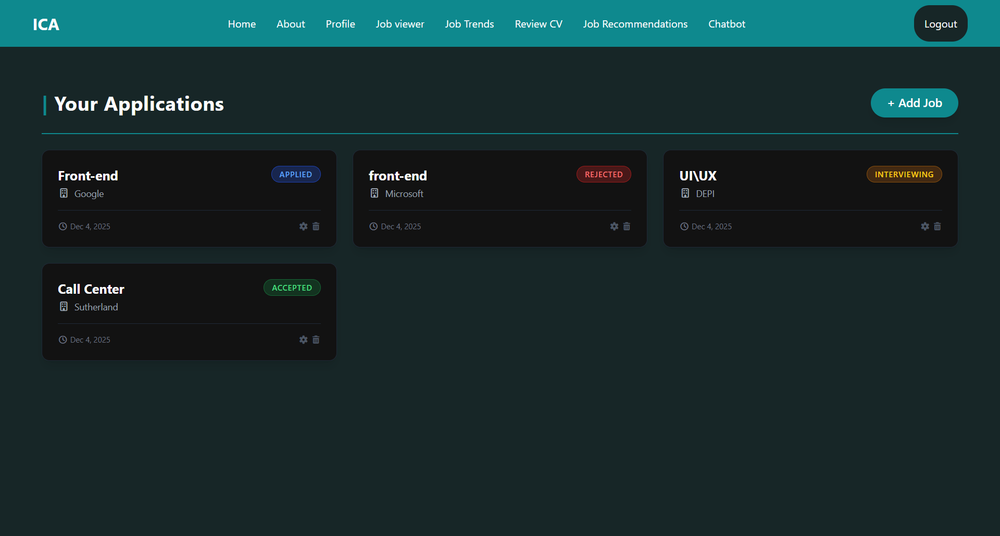

# 🚀 Intelligent Job Application Tracker

> **A generic, real-time job hunt organizer.**
> Keep track of your applications, interviews, and offers in one secure place.



## 📖 About The Project

**Job Application Tracker** is a modern, real-time web application designed to help job seekers organize their job hunt efficiently. Instead of relying on messy Excel sheets, users can track their applications, monitor interview statuses, and update progress in a secure, interactive dashboard.

🎓 **Digital Egypt Pioneers Initiative (DEPI)**
This project was developed as a Graduation Project under the Ministry of Communications and Information Technology (MCIT).

---

## ✨ Key Features

- **⚡ Real-time Synchronization:** Updates, additions, and deletions reflect instantly across devices using Firestore `onSnapshot` listeners.
- **🔐 User Data Isolation:** Implemented robust Firestore Security Rules to ensure users can only access and modify their own data.
- **📱 Fully Responsive:** Optimized for Mobile, Tablet, and Desktop using **Tailwind CSS**.
- **🛠️ Full CRUD Operations:** Seamlessly Add, Edit (with pre-filled data), and Delete applications with custom confirmation modals.
- **🎨 Smart UI/UX:** Dynamic status badges (e.g., Green for Accepted, Red for Rejected) and intelligent sorting (Oldest to Newest).

---

## 🛠️ Tech Stack

Built with a modern serverless architecture:

- **Frontend:**  (Hooks, Functional Components)
- **Styling:** 
- **Backend (BaaS):** 
- **Database:** Cloud Firestore (NoSQL)
- **Authentication:** Firebase Auth
- **Icons:** FontAwesome / Lucide React

---

## 🚀 How to Run Locally

Follow these steps to set up the project on your local machine:

### 1. Clone the repository

```bash
git clone [https://github.com/YE-19/Job-Application-Tracker.git](https://github.com/YE-19/Job-Application-Tracker.git)
cd job-tracker
```

### 2. Install Dependencies

Install the project dependencies and libraries.

```bash
npm install
# or
yarn install
```

### 3. Firebase Configuration

[!IMPORTANT]

> **For Your Privacy:**
> The `src/firebase.js` file currently contains **shared demo credentials** to allow you to test the app immediately without setup.
>
> If you plan to use this tracker for your **personal job hunt**, please create your own Firebase project and replace the keys above. This ensures your data remains **private, secure, and isolated** in your own database.

1. Go to the [Firebase Console](https://console.firebase.google.com/).
2. Create a new project.
3. Enable **Authentication** (Email/Password or Google).
4. Enable **Cloud Firestore** database.
5. Copy your firebase configuration keys and update `src/firebase.js` (or `.env` file):

```javascript
const firebaseConfig = {
  apiKey: "YOUR_API_KEY",
  authDomain: "YOUR_PROJECT_ID.firebaseapp.com",
  projectId: "YOUR_PROJECT_ID",
  storageBucket: "YOUR_PROJECT_ID.appspot.com",
  messagingSenderId: "YOUR_SENDER_ID",
  appId: "YOUR_APP_ID",
};
```

### 4. Run the App

Start the development server.

```bash
npm run dev
```

## 📂 Database Schema (Firestore)

The application uses a NoSQL structure optimized for performance and security.

**Collection:** `jobs`

| Field         | Type      | Description                                      |
| :------------ | :-------- | :----------------------------------------------- |
| `id`          | string    | Auto-generated Document ID                       |
| `userId`      | string    | The UID of the authenticated user (Security Key) |
| `jobTitle`    | string    | Title of the position (e.g., Frontend Dev)       |
| `companyName` | string    | Name of the company                              |
| `status`      | string    | Applied / Interviewing / Offered / Rejected      |
| `createdAt`   | timestamp | Server timestamp for sorting                     |

---

## 🔒 Security Rules

To ensure data privacy, the following Firestore rules are implemented to restrict access so users only see their own data:

```javascript
rules_version = '2';
service cloud.firestore {
  match /databases/{database}/documents {
    match /jobs/{jobId} {
      // Allow create only if the auth uid matches the data userId
      allow create: if request.auth != null && request.resource.data.userId == request.auth.uid;

      // Allow read/write only if the existing document belongs to the user
      allow read, update, delete: if request.auth != null && resource.data.userId == request.auth.uid;
    }
  }
}
```

## 👤 Author

**Youssef Ehab Aly**

- LinkedIn: [Youssef Ehab](https://www.linkedin.com/in/youssef-ehab-ye19/)
- GitHub: [YE-19](https://github.com/YE-19)
- Live Demo: [Job Application Tracker](https://job-application-tracker-silk-iota.vercel.app/)

---

## 🤝 Acknowledgments

Special thanks to **DEPI (Digital Egypt Pioneers Initiative)** and **MCIT** for the comprehensive training and support throughout this journey.
